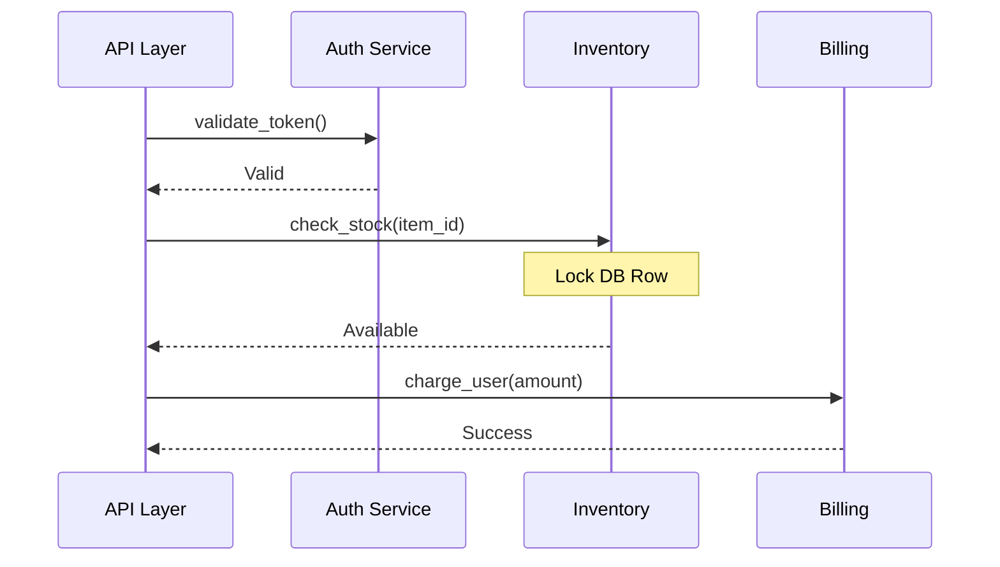

# Business Flow Expert

## Description
This skill acts as a dynamic tracer for your codebase. Unlike static analysis tools that look at structure, this skill reconstructs the *actual* execution path of a specific feature or request. It combines static code reading with runtime artifacts (Config Files, Logs) to map out exactly "what happens next" at a function level, translating technical calls into clear business steps.

## Usage Scenario
Trigger this skill when:
- "Tracing a request": User wants to know the exact path a request takes from entry to exit.
- "Debugging logic errors": Need to find where a specific business rule is applied.
- "Mapping config to code": User asks "Where is this config value used?" or "What happens when I enable flag X?".
- "Log analysis": User provides a log snippet and asks "Which code generated this?" or "What happened before this error?".

## Instructions

### 1. Context Gathering
- **Entry Point**: Identify the trigger (API endpoint, CLI command, Cron job).
- **Configuration**: Read relevant config files (YAML/JSON/Env) to determine active branches (e.g., `if config.use_new_flow:`).
- **Logs (Optional)**: If provided, use log messages as "anchor points" to verify the path.

### 2. Deep Tracing (Function Level)
- **Step-by-Step**: Start from the entry function. For each function call:
  1. **Read**: Read the function body.
  2. **Branch**: Determine which path is taken based on Config/Context.
  3. **Map**: Translate the technical function name (e.g., `process_payment_v2`) to a Business Step (e.g., "Execute Stripe Payment").
  4. **Drill Down**: Recursively trace into sub-functions if they contain core business logic (ignore utils/helpers).

### 3. Business Logic Mapping
- **Annotation**: For each step, add a note explaining *why* this step exists in business terms.
- **Data State**: Track how key data objects (e.g., `User`, `Order`) change state between steps.
- **Log Mapping**: Mark where logs would be emitted (e.g., `[LOG] "Order created"`).

### 4. Output Generation
- Produce a **Sequence Diagram** showing the call stack.
- Generate a **Trace Table** linking File:Line -> Function -> Business Meaning.

## Output Template

> **Note**: This content MUST be saved to a file.
> **Default Path**: `flow-traces/trace-{feature_name}-{timestamp}.md`

```markdown
# Business Flow Trace: {feature_name}

## Context
- **Entry Point**: `{function_name}` in `{file_path}`
- **Active Config**: 
  - `ENABLE_FEATURE_X = True`
  - `MAX_RETRIES = 3`

## Execution Summary
1. **Receive Request** (API Layer)
2. **Validate User** (Auth Service)
3. **Check Inventory** (Stock Service)
4. **Deduct Balance** (Billing Service)

## Detailed Function Trace

| Step | Function | File:Line | Business Logic / Data State | Config/Log |
|------|----------|-----------|-----------------------------|------------|
| 1 | `handle_request` | `api/views.py:45` | Entry point. Parses JSON body. | |
| 1.1 | `validate_token` | `auth/utils.py:12` | Checks JWT signature. | `[LOG] User authenticated` |
| 2 | `process_order` | `services/order.py:102` | **Core Logic**. Orchestrates the flow. | |
| 2.1 | `check_stock` | `services/inventory.py:30` | Locks DB row. Checks `qty > 0`. | If `qty=0` -> Raise Error |
| 2.2 | `charge_user` | `services/billing.py:55` | Calls Stripe API. | `USE_STRIPE=True` |

## Visual Sequence


## Key Findings
- **Critical Logic**: The inventory check happens *before* payment (Line 105).
- **Config Impact**: Because `USE_STRIPE` is True, `charge_user` calls `stripe_adapter.py`.
- **Potential Issue**: No rollback logic found in `process_order` if billing fails after stock lock.
```

## Resources
- **Checklist**:
  - [ ] Have I traced into the implementation of abstract interfaces?
  - [ ] Did I account for the provided configuration flags?
  - [ ] Are the business terms accurate (not just repeating function names)?
  - [ ] Is the sequence diagram consistent with the trace table?
