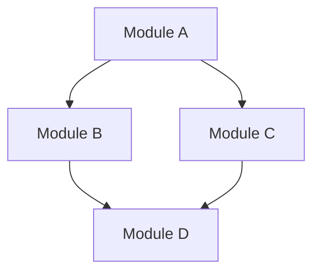

# System Architecture Overview

## Project Overview
**Project Name:** {project_name}
**Technology Stack:** {tech_stack}
**Repository Size:** {file_count} files, {line_count} lines of code
**Last Updated:** {date}

## High-Level Architecture
{description of overall architecture pattern (monolith, microservices, layered, etc.)}

## Layered Structure
```
┌─────────────────────────────────────────────────────┐
│                   Presentation Layer                │
│  (UI, API endpoints, client interfaces)             │
├─────────────────────────────────────────────────────┤
│                   Business Logic Layer              │
│  (Core services, domain logic, use cases)           │
├─────────────────────────────────────────────────────┤
│                   Data Access Layer                 │
│  (Database repositories, external service clients)  │
├─────────────────────────────────────────────────────┤
│                   Infrastructure Layer              │
│  (Database, message queues, third-party services)   │
└─────────────────────────────────────────────────────┘
```

## Core Components
| Component | Responsibility | Key Files |
|-----------|----------------|-----------|
| {component_1} | {responsibility} | {file_paths} |
| {component_2} | {responsibility} | {file_paths} |
| {component_3} | {responsibility} | {file_paths} |

## Module Relationships

{explanation of key relationships and data flow}

## External Dependencies
- {dependency_1}: {purpose}
- {dependency_2}: {purpose}

## Entry Points
- Main application: {path_to_main_file}
- API entry: {path_to_api_entry}
- CLI entry: {path_to_cli_entry}
