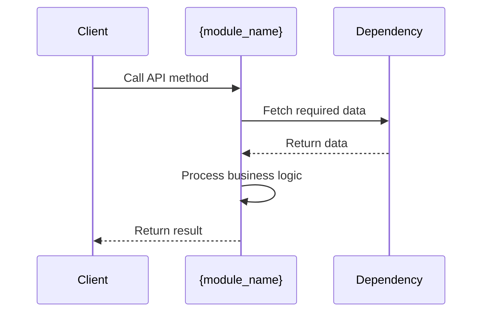

# {module_name} Module

## Basic Information
- **Classification:** {module_type}
- **Complexity:** {low/medium/high}
- **Location:** {directory_path}
- **File Count:** {file_count} files
- **Last Updated:** {date}

## Core Responsibility
{1-2 sentence summary of what this module does and its purpose in the overall system}

## Public API
### Exports
| Export | Type | Description |
|--------|------|-------------|
| {export_1} | {class/function/constant} | {description} |
| {export_2} | {class/function/constant} | {description} |

### Key Methods
```typescript
/**
 * {method_description}
 * @param {param_type} param - {param_description}
 * @returns {return_type} {return_description}
 */
function {method_name}(param: param_type): return_type;
```

## Dependencies
### Internal Dependencies
- {module_a}: {what it uses from module_a}
- {module_b}: {what it uses from module_b}

### External Dependencies
- {package_1}: {version} - {purpose}
- {package_2}: {version} - {purpose}

## Key Data Structures
```typescript
interface {data_structure_name} {
  field1: type; // {description}
  field2: type; // {description}
}
```

## Main Workflow

{step-by-step explanation of typical usage flow}

## Important Implementation Details
- {detail_1}: {explanation of key implementation choice or pattern}
- {detail_2}: {explanation of edge cases or special handling}

## Usage Examples
```{language}
// Typical usage example
import { {export_name} } from '{module_path}';

const result = {export_name}(params);
```
